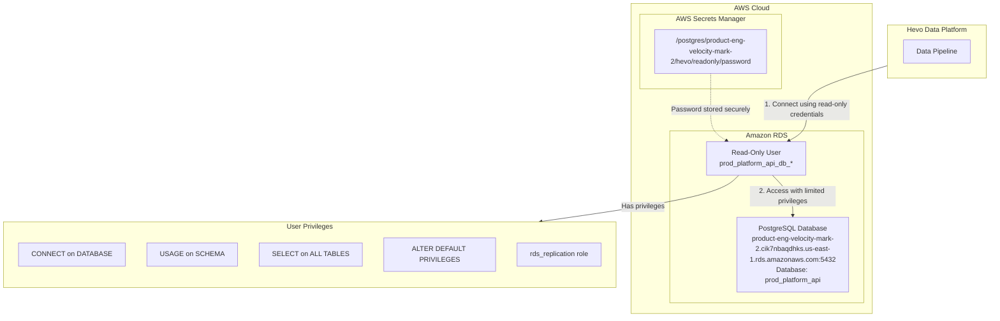

# PostgreSQL Configuration for Hevo Data Pipeline

This document describes the PostgreSQL configuration for Hevo data pipeline integration, including how Hevo connects to our PostgreSQL database and the security measures in place.

## Architecture Overview

The following diagram illustrates how Hevo connects to our PostgreSQL database:

## Configuration Details

### PostgreSQL Database

- **Host**: product-eng-velocity-mark-2.cik7nbaqdhks.us-east-1.rds.amazonaws.com
- **Port**: 5432
- **Database**: prod_platform_api
- **Schema**: public

### Read-Only User

A dedicated read-only user is created specifically for Hevo data pipeline operations. This user has the following characteristics:

- **Username**: Automatically generated with prefix `prod_platform_api_db_` followed by a random suffix
- **Password**: Randomly generated secure password stored in AWS Secrets Manager
- **Login**: Enabled
- **Comment**: "Read-only user for Hevo data pipeline operations"

### User Privileges

The read-only user is granted the following privileges, as required by Hevo:

1. **CONNECT** on DATABASE `prod_platform_api`
2. **USAGE** on SCHEMA `public`
3. **SELECT** on ALL TABLES in SCHEMA `public`
4. **ALTER DEFAULT PRIVILEGES** to grant SELECT on future tables
5. **rds_replication** role for log-based incremental replication

These privileges ensure that Hevo can:
- Connect to the database
- Access the schema
- Read data from all existing tables
- Read data from tables created in the future
- Use log-based incremental replication for efficient data transfer

### Password Management

The password for the read-only user is:
- Generated using a secure random generator
- Contains a mix of uppercase, lowercase, numbers, and special characters
- 24 characters in length
- Stored securely in AWS Secrets Manager at the path: `/postgres/product-eng-velocity-mark-2/hevo/readonly/password`

## Connecting Hevo to PostgreSQL

When configuring Hevo, you'll need to provide the following information:

1. **Source Type**: Amazon RDS PostgreSQL
2. **Connection Settings**:
   - **Database Host**: product-eng-velocity-mark-2.cik7nbaqdhks.us-east-1.rds.amazonaws.com
   - **Database Port**: 5432
   - **Database User**: The generated username (retrieve from Terraform output)
   - **Database Password**: Retrieve from AWS Secrets Manager
   - **Database Name**: prod_platform_api

3. **Ingestion Mode**: Logical Replication (recommended)
   - This mode uses PostgreSQL's Write Ahead Logs (WAL) for efficient data replication

4. **Object Selection**: Select the tables you want to replicate

For detailed instructions on configuring Hevo, refer to the [Hevo documentation for Amazon RDS PostgreSQL](https://docs.hevodata.com/sources/dbfs/databases/postgresql/amazon-rds-postgresql/).

## Implementation Details

The PostgreSQL configuration is implemented using Terraform with a reusable module:

- **Module**: `modules/postgres-hevo-ro-user`
- **Main Configuration**: `workspaces/authentication/postgres.tf`

The module handles:
- Creating the read-only user with a secure password
- Storing the password in AWS Secrets Manager
- Granting the necessary privileges to the user
- Setting up default privileges for future tables

## Security Considerations

- The read-only user has minimal privileges (principle of least privilege)
- The password is securely stored in AWS Secrets Manager
- The password is not stored in Terraform state
- Log-based replication is enabled for efficient data transfer
- The database connection can be secured using SSL (if enabled)
