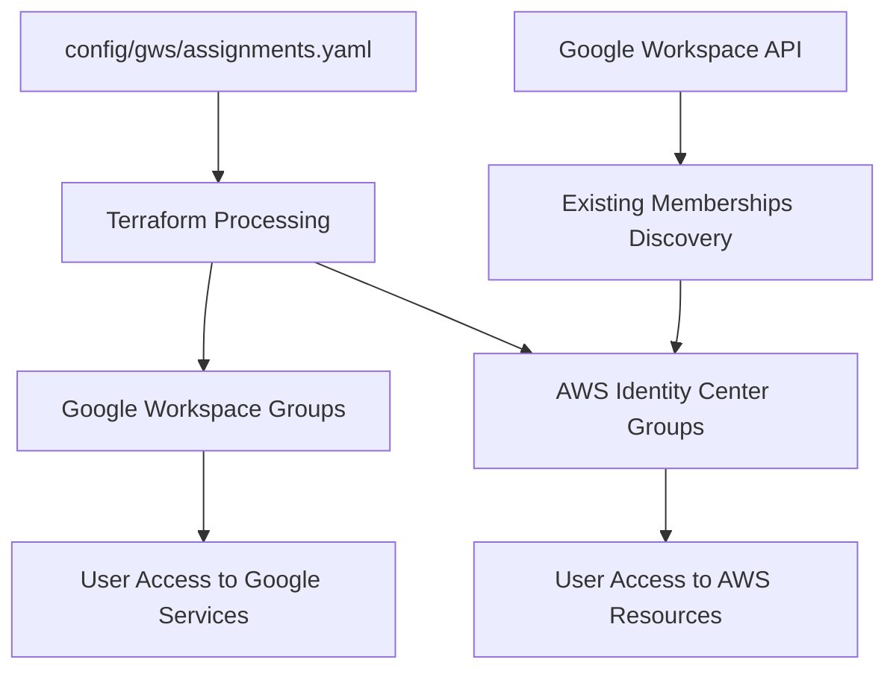

# Google Workspace Group Assignments

This Terraform workspace manages Google Workspace group memberships and automatically synchronizes them to AWS SSO (Identity Center) groups for Flipside Crypto's organization.

## Overview

The assignments workspace provides:
- **Flexible Group Management**: Manage memberships via Terraform configuration OR directly in Google Workspace Admin Console
- **Universal AWS Sync**: All group memberships sync to AWS SSO regardless of management method
- **Role-based Access Control**: Supports OWNER, MANAGER, and MEMBER roles for fine-grained access control
- **Nested Group Support**: Allows groups to be members of other groups for hierarchical access management

### 🔑 Key Feature: Dual Management Approach

**You can manage group memberships in two ways:**
1. **Repository-based**: Define memberships in `config/gws/assignments.yaml` (managed by Terraform)
2. **Web Interface**: Add/remove members directly in Google Workspace Admin Console as a group owner

**Both approaches sync to AWS SSO automatically** - the system discovers all memberships from Google Workspace and propagates them to AWS Identity Center, ensuring consistent access across platforms.

## Architecture



## Configuration

### Group Definition Structure

Groups are defined in `config/gws/assignments.yaml` using the following structure:

```yaml
groups:
  group_name@flipsidecrypto.com:
    email: optional-alias@domain.com  # Optional: custom email alias
    members:
      user@flipsidecrypto.com:
        role: OWNER|MANAGER|MEMBER
        type: USER
      another_group@flipsidecrypto.com:
        role: OWNER|MANAGER|MEMBER
        type: GROUP
```

### Member Roles

- **OWNER**: Full administrative rights to the group
- **MANAGER**: Can manage group settings and moderate members
- **MEMBER**: Standard group membership without administrative privileges

### Member Types

- **USER**: Individual user account
- **GROUP**: Another Google Workspace group (enables nested group hierarchies)

## Current Groups

The workspace currently manages the following groups:

### Core Teams
- `analytics@flipsidecrypto.com` - Data analytics team (16 members)
- `finops@flipsidecrypto.com` - Financial operations team
- `trading@flipsidecrypto.com` - Trading operations team
- `treasury@flipsidecrypto.com` - Treasury management team
- `eng-infra@flipsidecrypto.com` - Engineering infrastructure team

### Administrative Groups
- `billing@flipsidecrypto.com` - Billing management (includes finops group)
- `blockchain_admins@flipsidecrypto.com` - Blockchain infrastructure administrators
- `gcp_billing_admins@flipsidecrypto.com` - Google Cloud billing administrators
- `applemanager@flipsidecrypto.com` - Apple device management

### Financial Groups
- `invoices@flipsidecrypto.com` - Invoice processing
- `receipts@flipsidecrypto.com` - Receipt management
- `taxforms@flipsidecrypto.com` - Tax document management

### Request Groups
- `analytics_requests@flipsidecrypto.com` - Analytics request handling

## Features

### Automatic AWS SSO Synchronization

The workspace automatically:
1. Creates corresponding groups in AWS Identity Center
2. Discovers all members from Google Workspace (both Terraform-managed and UI-managed)
3. Syncs group memberships to AWS SSO for users that exist in both systems
4. Maintains consistency between Google Workspace and AWS access

### Hybrid Management Support

The system intelligently supports **both management approaches simultaneously**:

#### Repository Management (Terraform)
- Define memberships in `config/gws/assignments.yaml`
- Version-controlled and auditable changes
- Automated deployment through infrastructure-as-code

#### Web Interface Management (Google Admin Console)
- Group owners can directly add/remove members in Google Workspace Admin Console
- No Terraform knowledge required for day-to-day membership changes
- Immediate access provisioning for urgent requests

#### Automatic Discovery & Sync
The workspace uses `data.googleworkspace_group_members` to discover **all** existing memberships from Google Workspace, whether they were:
- Created by Terraform (from the YAML configuration)
- Added manually through the Google Workspace web interface
- Added by other automated systems

**Result**: Every membership in Google Workspace automatically appears in corresponding AWS SSO groups, ensuring unified access control regardless of management method.

### Efficient Resource Management

- Uses local data processing to minimize API calls
- Creates lookup maps for efficient group and user resolution
- Flattens nested configurations for individual membership resources

## Usage

### Adding a New Group

1. Add the group definition to `config/gws/assignments.yaml`:
```yaml
groups:
  new_team@flipsidecrypto.com:
    members:
      user1@flipsidecrypto.com:
        role: OWNER
        type: USER
      user2@flipsidecrypto.com:
        role: MEMBER
        type: USER
```

2. Plan and apply the changes:
```bash
terragrunt plan
terragrunt apply
```

### Adding Members to Existing Groups

1. Update the group definition in `config/gws/assignments.yaml`
2. Apply the changes:
```bash
terragrunt apply
```

### Nested Group Membership

To add a group as a member of another group:

```yaml
groups:
  parent_group@flipsidecrypto.com:
    members:
      child_group@flipsidecrypto.com:
        role: MEMBER
        type: GROUP
```

## Dependencies

### Google Workspace Requirements
- Google Workspace Admin API access
- Service account with Domain-wide Delegation
- Appropriate OAuth scopes for group management

### AWS Requirements
- AWS SSO/Identity Center configured
- IAM permissions for Identity Store operations
- Users must exist in both Google Workspace and AWS Identity Center for sync

### Terraform Providers
- `googleworkspace`: Google Workspace management
- `aws`: AWS Identity Center operations

## State Management

This workspace uses:
- **Remote State**: Stored in Google Cloud Storage
- **State Locking**: Prevents concurrent modifications
- **Workspace Isolation**: Independent state from other workspaces

## Monitoring and Troubleshooting

### Log Files
- Check `logs/` directory for deployment logs
- Review Terraform output for resource creation status

### Common Issues

1. **User Not Found in AWS**: Users must exist in AWS Identity Center before sync
2. **Permission Errors**: Verify service account has proper Google Workspace and AWS permissions
3. **Group Already Exists**: Check for existing groups created outside Terraform

### Validation

After deployment, verify:
- Group memberships in Google Workspace Admin Console
- Corresponding groups created in AWS Identity Center
- User access to intended resources

## Security Considerations

- All group management follows principle of least privilege
- Service accounts use minimal required permissions
- Group memberships are auditable through Git history
- AWS sync ensures consistent access control across platforms

## Related Workspaces

- `gws/org_units`: Manages Google Workspace organizational structure
- `gcp/authentication`: Manages service accounts and IAM
- `generator`: Orchestrates workspace configuration and deployment
