# @jbcom/cursor-fleet

Unified Cursor Background Agent fleet management for control centers.

## Features

- **Agent Discovery** - List, filter, and find agents by status
- **Agent Spawning** - Launch new agents with coordination context
- **Agent Communication** - Send follow-ups and broadcast messages
- **Conversation Management** - Archive and split large conversations
- **Diamond Pattern** - Coordinate multiple agents across repos
- **Fleet Monitoring** - Watch, monitor, and coordinate agent fleets
- **Bidirectional Coordination** - PR-based communication with sub-agents

## Installation

```bash
npm install @jbcom/cursor-fleet
# or
pnpm add @jbcom/cursor-fleet
```

## Environment Variables

| Variable | Required | Description |
|----------|----------|-------------|
| `CURSOR_API_KEY` | Yes* | Cursor API key for direct API access |
| `CURSOR_API_BASE_URL` | No | Override API base URL (testing) |
| `GITHUB_JBCOM_TOKEN` | For coordination | GitHub token for PR operations |

*If not set, falls back to MCP client which requires `mcp-proxy` running.

## CLI Usage

```bash
# List all agents
cursor-fleet list
cursor-fleet list --running --json

# Spawn new agent
cursor-fleet spawn https://github.com/org/repo "Fix the bug" --ref main

# Agent status
cursor-fleet status bc-xxx-xxx

# Send follow-up
cursor-fleet followup bc-xxx-xxx "How is progress?"

# Broadcast to all running agents
cursor-fleet broadcast "Status check" --running

# Get conversation
cursor-fleet conversation bc-xxx-xxx --last 50

# Split conversation into readable files
cursor-fleet split bc-xxx-xxx --output ./recovery

# Archive conversation
cursor-fleet archive bc-xxx-xxx -o ./archive.json

# Fleet summary
cursor-fleet summary

# Watch fleet (daemon mode)
cursor-fleet watch --poll 30000 --stall 600000

# Monitor specific agents until done
cursor-fleet monitor bc-xxx bc-yyy bc-zzz

# Run bidirectional coordinator
cursor-fleet coordinate --pr 123 --agents bc-xxx,bc-yyy
```

## API Usage

```typescript
import { Fleet, CursorAPI, splitConversation } from "@jbcom/cursor-fleet";

// High-level Fleet API
const fleet = new Fleet();

// List agents
const agents = await fleet.list();
const running = await fleet.running();

// Spawn new agent
const result = await fleet.spawn({
  repository: "https://github.com/org/repo",
  task: "Fix authentication bug",
  ref: "main",
  context: {
    controlManagerId: "bc-my-agent",
    controlCenter: "jbcom Control Center",
  },
});

// Send follow-up
await fleet.followup("bc-xxx", "Status update?");

// Get and split conversation
const splitResult = await fleet.split("bc-xxx", "./output");

// Direct API access (lower level)
const api = new CursorAPI({ apiKey: "your-key" });
const conversation = await api.getAgentConversation("bc-xxx");
```

## Architecture


## Coordination System

### Hold-Open PR Pattern

For long-running sessions that need to manage multiple merges:


### Bidirectional Coordination

The coordinator runs two concurrent loops:

```mermaid
graph LR
    subgraph "OUTBOUND Loop (60s)"
        O1[Check agent status]
        O2[Send follow-up if running]
        O3[Remove finished agents]
        O1 --> O2 --> O3 --> O1
    end
    
    subgraph "INBOUND Loop (15s)"
        I1[Poll PR comments]
        I2[Parse @cursor mentions]
        I3[Dispatch actions]
        I1 --> I2 --> I3 --> I1
    end
    
    O2 -.->|"Status check"| SubAgent[Sub-Agent]
    SubAgent -.->|"@cursor ✅ DONE"| I2
```



### Coordination Protocol

Sub-agents report status by commenting on the coordination PR:

| Format | Meaning |
|--------|---------|
| `@cursor ✅ DONE: [agent-id] [summary]` | Task completed |
| `@cursor ⚠️ BLOCKED: [agent-id] [issue]` | Needs intervention |
| `@cursor 📊 STATUS: [agent-id] [progress]` | Progress update |
| `@cursor 🔄 HANDOFF: [agent-id] [info]` | Ready for next step |

## Diamond Pattern

For coordinating work across multiple repositories:


## process-compose Integration

Add to `process-compose.yml`:

```yaml
fleet-coordinator:
  command: >
    node packages/cursor-fleet/dist/cli.js coordinate 
    --pr ${COORDINATION_PR} 
    --agents ${AGENT_IDS}
    --repo jbcom/jbcom-control-center
  environment:
    - "GITHUB_JBCOM_TOKEN=${GITHUB_JBCOM_TOKEN}"
    - "CURSOR_API_KEY=${CURSOR_API_KEY}"
  disabled: true  # Enable when needed

fleet-watcher:
  command: >
    node packages/cursor-fleet/dist/cli.js watch 
    --poll 30000 
    --stall 600000
  disabled: true
```

Run with:
```bash
COORDINATION_PR=123 AGENT_IDS=bc-xxx,bc-yyy process-compose up fleet-coordinator
```

## Conversation Splitting

Large conversations can be split for analysis:

```typescript
import { splitConversation } from "@jbcom/cursor-fleet";

const result = await splitConversation(conversation, {
  outputDir: "./recovery/bc-xxx",
  batchSize: 50,
  prettyPrint: true,
});

// Creates:
// ./recovery/bc-xxx/
// ├── metadata.json         # Agent info, message count
// ├── conversation.txt      # Full readable transcript
// ├── original.json         # Original JSON
// ├── messages/
// │   ├── 0001_user.json
// │   ├── 0001_user.txt
// │   ├── 0002_assistant.json
// │   └── ...
// └── batches/
//     ├── batch_001.json
//     ├── batch_001.txt
//     └── ...
```

## API Reference

### Fleet Class

| Method | Description |
|--------|-------------|
| `list()` | List all agents |
| `running()` | List running agents |
| `status(agentId)` | Get agent status |
| `spawn(options)` | Launch new agent |
| `followup(agentId, message)` | Send follow-up |
| `broadcast(agentIds, message)` | Broadcast to agents |
| `conversation(agentId)` | Get conversation |
| `split(agentId, outputDir?)` | Split conversation |
| `archive(agentId, path?)` | Archive to disk |
| `repositories()` | List available repos |
| `summary()` | Get fleet summary |
| `waitFor(agentId, options?)` | Wait for completion |
| `watch(options)` | Watch fleet status |
| `monitorAgents(agentIds, options?)` | Monitor until done |
| `coordinate(config)` | Run coordination loop |
| `createDiamond(options)` | Diamond orchestration |

### CursorAPI Class

| Method | Description |
|--------|-------------|
| `listAgents()` | List all agents |
| `getAgentStatus(agentId)` | Get agent status |
| `getAgentConversation(agentId)` | Get conversation |
| `launchAgent(options)` | Launch new agent |
| `addFollowup(agentId, prompt)` | Send follow-up |
| `listRepositories()` | List repositories |

## Security

- API keys are never logged in error messages
- All user inputs are validated before API calls
- Agent IDs are URL-encoded to prevent injection
- Error messages are sanitized to remove tokens

## Related

- [Fleet Coordination Guide](../../.ruler/fleet-coordination.md)
- [Hold-Open PR Pattern](../../.ruler/cursor.md)
- [Agent Instructions](../../.ruler/AGENTS.md)

---

**Package**: `@jbcom/cursor-fleet`
**Version**: 0.1.0
**License**: MIT
